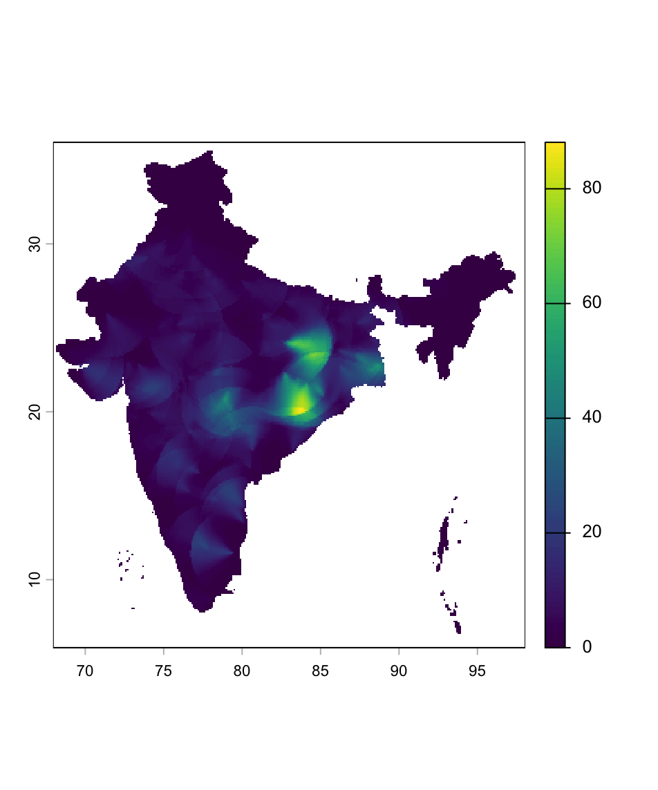

The contents of this post fall squarely within the category of things I'd forget if I didn't write them down. Recently I found myself in a bit of a pickle. I was computing 144 months worth of exposure to pollution from coal-fired power plants for every single 10 square-km pixel over land in India.

This can be done rather painlessly in R using the [`sf`](https://cran.r-project.org/web/packages/sf/index.html) (simple features) and [`terra`](https://cran.r-project.org/web/packages/terra/index.html) packages. Still, with the amounts of data being processed, storage and RAM can run low. I took care not to load big chunks of data at once to address the storage bottle neck, and heavily relied on `terra` functions that run [C++](https://isocpp.org/) under the hood to save RAM. Soon I had pretty maps of monthly coal pollution exposure like this one for March 2020.



Curiously, though, I could only run the script exactly once before it filled up all the free space left on my 250GB SSD. I had assumed that temporary files are forgotten as a result of the fabulously named `gc` (garbage collect) command. Not so. Then, surely, if I were to close my current R session *temporarrrrry* files would be unlinked...right? Again, no. The only way I knew of to free up the drive and make my computer - never mind R at this point - functional again was every tech support service worker's favourite word: restart.

Thankfully, after a bit of digging, I learned a better way to do this from within an active R session, thus leading us to the code snippet that ends this rant.


```{r}
old <- list.files(
  tempdir(), full.names = TRUE)
length(old)  # inspect count
# delete after inspection:
unlink(old, recursive = TRUE)
gc() # finally, garbage collect (not strictly necessary)
```